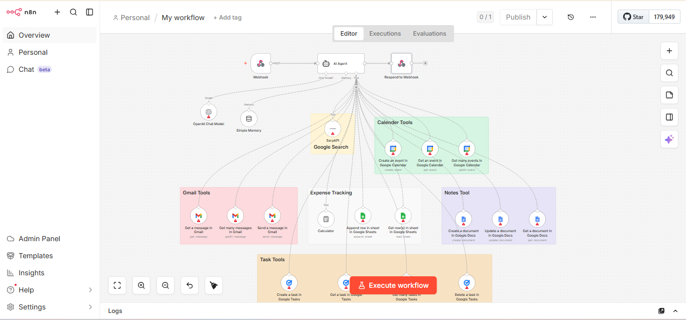

# AI Personal Productivity Assistant (n8n Workflow)

## 🚀 Overview

This project is an advanced AI-powered personal productivity assistant
built using **n8n**. It integrates multiple tools like Google Calendar,
Gmail, Google Sheets, Google Docs, Google Tasks, and Web Search to
automate daily workflows.

The system uses an AI Agent (LLM-based) to interpret user queries and
execute tasks intelligently via connected tools.

## 🖼️ Workflow Architecture

------------------------------------------------------------------------

## 🧠 Key Features

-   Automates task management, emails, calendar scheduling, and
    note-taking
-   Uses AI Agent for intelligent decision-making and tool selection
-   Supports multi-step task execution
-   Integrated memory for contextual conversations
-   Expense tracking via Google Sheets
-   Web search using SerpAPI
-   Real-time webhook-based interaction

------------------------------------------------------------------------

## 🏗️ Architecture

### Workflow Components:

1.  **Webhook Trigger**
    -   Entry point for user requests
2.  **AI Agent (Core Brain)**
    -   Interprets user input
    -   Decides which tools to use
    -   Executes tasks step-by-step
3.  **Memory Module**
    -   Maintains conversation context
4.  **Integrated Tools**
    -   Google Calendar (events management)
    -   Gmail (read/send emails)
    -   Google Sheets (expense tracking)
    -   Google Docs (notes management)
    -   Google Tasks (task automation)
    -   SerpAPI (web search)
    -   Calculator (math operations)
5.  **Response Node**
    -   Sends final output back to user

------------------------------------------------------------------------

## 🔧 Tools & Integrations

-   n8n
-   OpenAI (GPT model)
-   Google APIs:
    -   Calendar
    -   Gmail
    -   Sheets
    -   Docs
    -   Tasks
-   SerpAPI

------------------------------------------------------------------------

## ⚙️ How It Works

1.  User sends request via webhook
2.  AI Agent processes the request
3.  Agent selects appropriate tool(s)
4.  Executes tasks in correct order
5.  Returns final response

------------------------------------------------------------------------

## 📊 Example Use Cases

-   "Schedule a meeting tomorrow at 5 PM"
-   "Send email to HR"
-   "Add ₹500 expense under food"
-   "Create a task for project submission"
-   "Search latest AI trends"

------------------------------------------------------------------------

## 🔐 Guardrails & Logic

-   Prevents redundant tool calls
-   Avoids hallucination of outputs
-   Requires IDs when necessary
-   Stops execution on failure
-   Ensures structured responses

------------------------------------------------------------------------

## 📁 Project File

-   Workflow JSON: Attached in this repository
